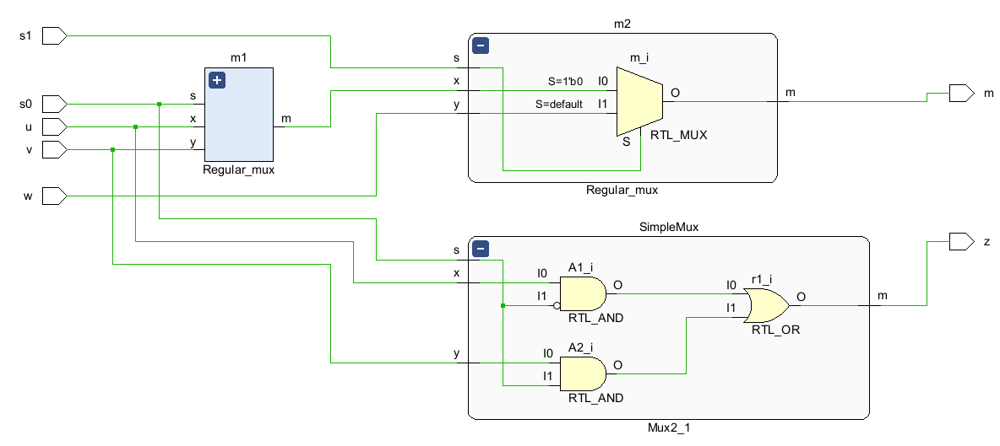
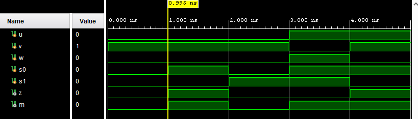

# FPGA Multiplexer Design & Verification

## Project Overview

This project demonstrates **fundamental FPGA digital design and verification practices** using a multiplexer (MUX) example implemented and simulated in **Xilinx Vivado**.

Rather than focusing on complexity, the intent of this project is to show **clean RTL design, structured testbenching, and an industry-appropriate workflow** suitable for FPGA and embedded systems roles.

### The project emphasizes:

- Correct RTL modeling
- Explicit verification of functionality
- Awareness of design evolution and architectural intent
- Clean separation between source, testbench, and build artifacts

=====================================
### Module_mux (Vivado / Verilog)

Two-stage mux chain + simple 2:1 mux output.

#### 2 stage Mux Test (3 bits)
- Behavioral modeling 
  - always, if loops used

#### Simple 2 bit Mux test (2 bits)
- Structural modeling 
  - wires and gates used

### Testbench 
Contains 5 test cases to test both mux modules

### RTL screenshot

- This design compares structural and behavioral RTL methodologies by implementing equivalent multiplexer logic using hierarchical module instantiation versus explicit gate-level logic, demonstrating understanding of hardware abstraction and design tradeoffs.

### Waveform screenshot 

- u,v, and w are the inputs and s0,s1 are the selectors. 
- The test confirms both multiplexers work.

## Lessons Learned

- Workflow
  - Structured RTL, testbench, and waveform files 
  - Improved intuition for simulation setup, hierarchy, and waveform debugging
- Behavioral vs. Structural Design
  - Reinforced how behavioral logic maps to structural module instantiation
  - Observed signal propagation and override behavior in cascaded designs
- Version Control
  - Used Git as the source of truth for RTL and testbench code
  - Excluded tool-generated artifacts to keep the repository clean